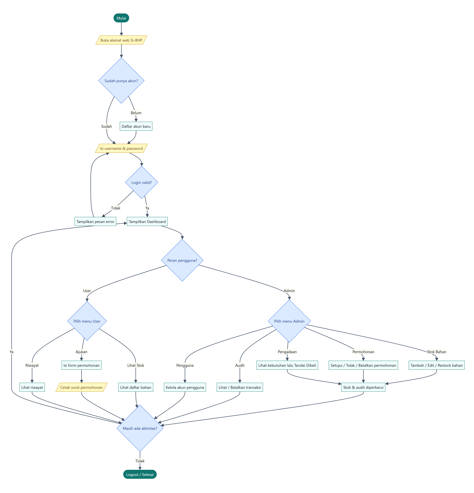
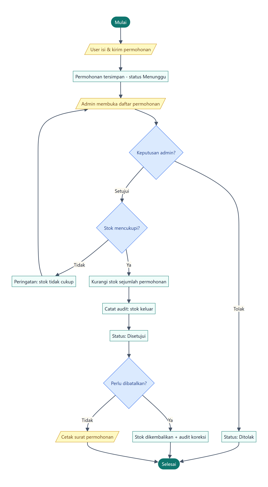

# Laporan Alur (Flowchart) — Si-BHP

**Sistem Informasi Inventaris Bahan Habis Pakai**
Jurusan Teknik Mesin — Politeknik Negeri Bengkalis

Dokumen ini menggambarkan alur kerja aplikasi Si-BHP dalam bentuk **flowchart**
sesuai kaidah baku (simbol terminator, proses, keputusan, dan input/output).

---

## Kaidah Simbol Flowchart

| Simbol | Bentuk | Arti |
|--------|--------|------|
| **Terminator** | Oval / kapsul (hijau) | Titik **Mulai** dan **Selesai** alur. |
| **Input/Output** | Jajar genjang (kuning) | Memasukkan data atau mengeluarkan hasil (mis. isi form, cetak surat). |
| **Proses** | Persegi panjang (putih) | Satu langkah proses/aksi yang dijalankan sistem atau pengguna. |
| **Keputusan** | Belah ketupat (biru) | Percabangan dengan jawaban Ya/Tidak atau pilihan. |
| **Garis panah** | Anak panah | Menunjukkan arah/urutan alur. |

---

## 1. Alur Umum Website

Menggambarkan perjalanan pengguna dari membuka website, login, hingga menggunakan
menu sesuai perannya (Admin atau User), lalu keluar.

**Penjelasan singkat:**

1. Pengguna membuka alamat web Si-BHP.
2. Jika belum punya akun → mendaftar; jika sudah → langsung mengisi username & password.
3. Sistem memeriksa login. Bila salah, tampil pesan error dan pengguna mencoba lagi.
4. Setelah berhasil, muncul **Dashboard**, lalu alur bercabang sesuai **peran**.
5. Jalur **Admin**: mengelola stok bahan, memproses permohonan, laporan pengadaan,
   riwayat/audit, dan kelola pengguna. Setiap aksi yang mengubah stok otomatis
   memperbarui stok dan mencatat audit.
6. Jalur **User**: melihat stok, mengajukan permohonan lalu mencetak surat, serta melihat riwayat.
7. Selama masih ada aktivitas, pengguna kembali ke Dashboard; bila selesai → **Logout**.

---

## 2. Alur Permohonan Bahan

Menggambarkan proses inti aplikasi: dari pengajuan oleh user, keputusan admin,
pengurangan stok, pencatatan audit, hingga pencetakan surat atau pembatalan.

**Penjelasan singkat:**

1. User mengisi dan mengirim permohonan → tersimpan dengan status **Menunggu**.
2. Admin membuka daftar permohonan dan mengambil keputusan:
   - **Tolak** → status menjadi **Ditolak** (stok tidak berubah).
   - **Setujui** → sistem memeriksa **apakah stok mencukupi**.
3. Bila stok tidak cukup → muncul peringatan, permohonan belum diproses.
4. Bila cukup → **stok dikurangi**, dicatat di **audit (stok keluar)**, status menjadi **Disetujui**.
5. Permohonan yang sudah disetujui masih bisa **dibatalkan** → stok dikembalikan dan
   dicatat sebagai koreksi di audit. Bila tidak, surat permohonan dapat dicetak.

---

*Catatan: kedua flowchart di atas juga tersedia sebagai berkas gambar terpisah di
folder `docs/images/` (`flow-umum.png` dan `flow-permohonan.png`).*
