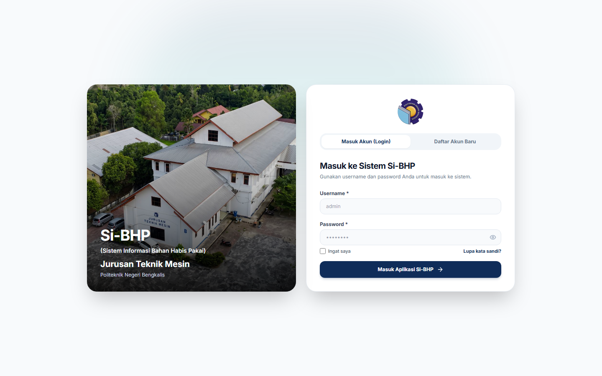
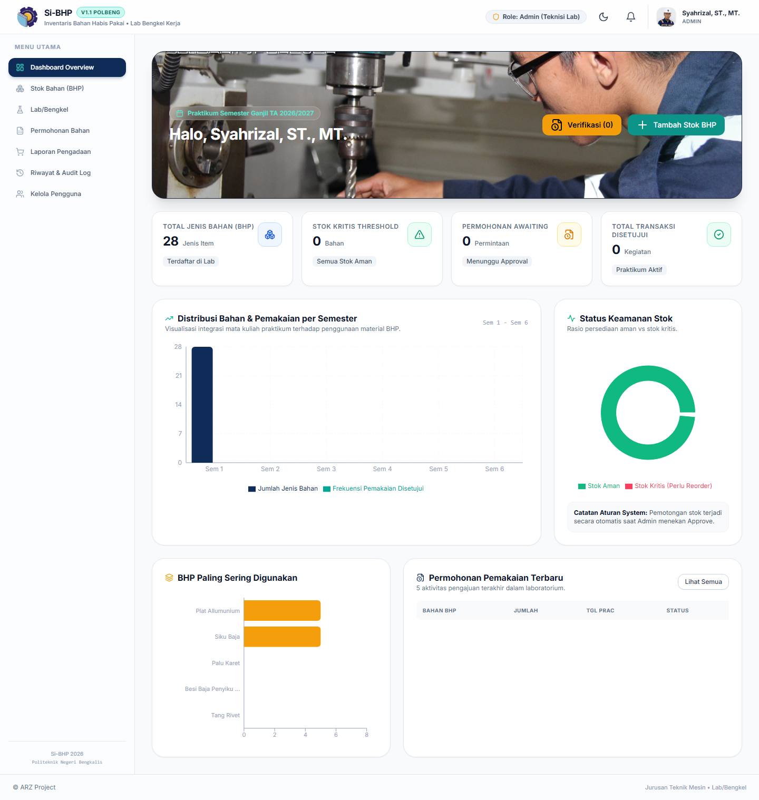
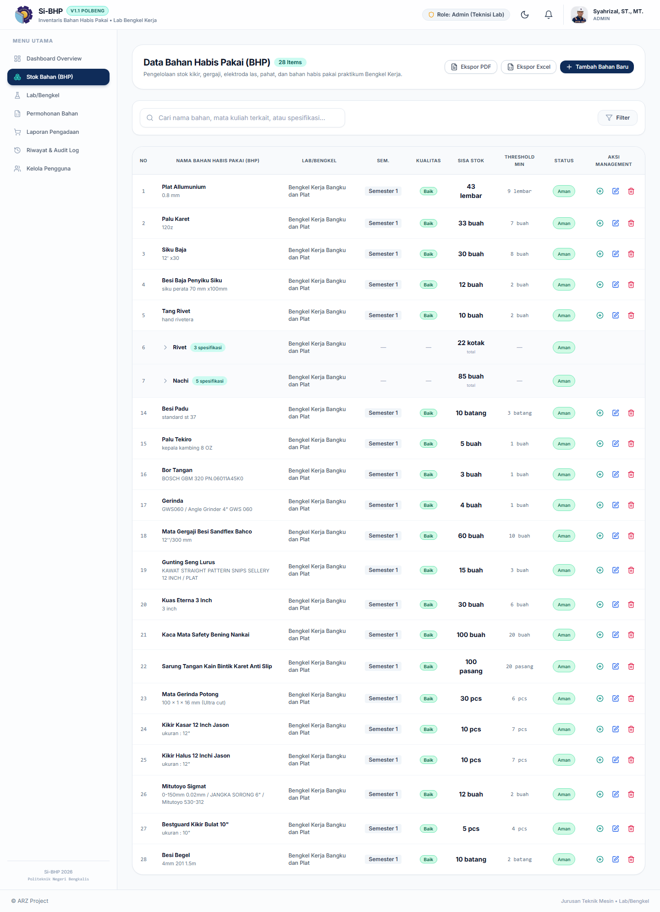
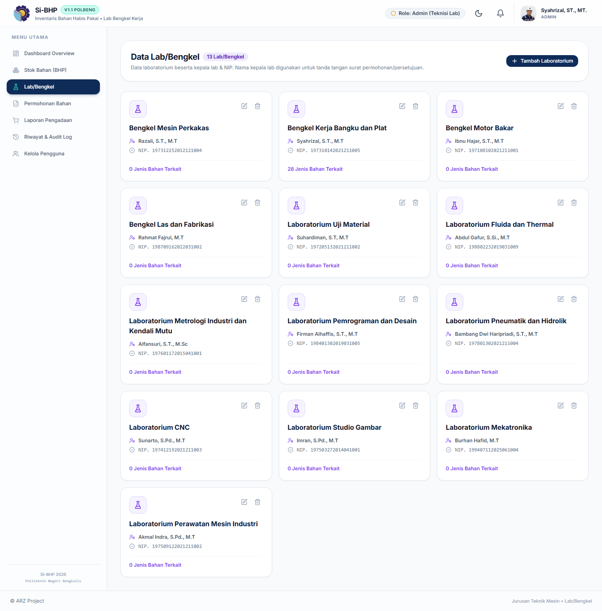
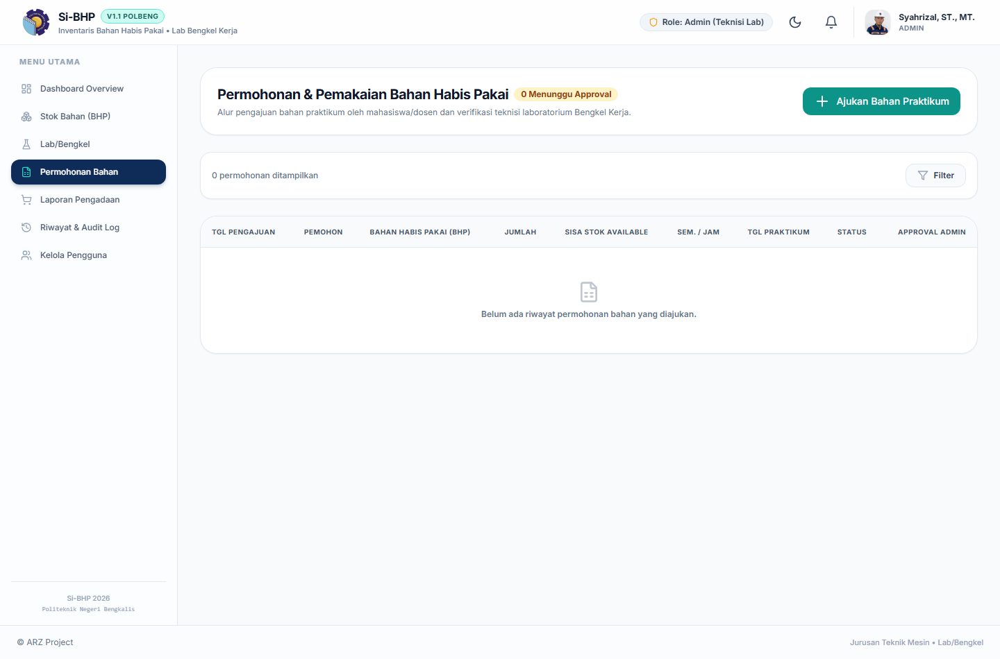
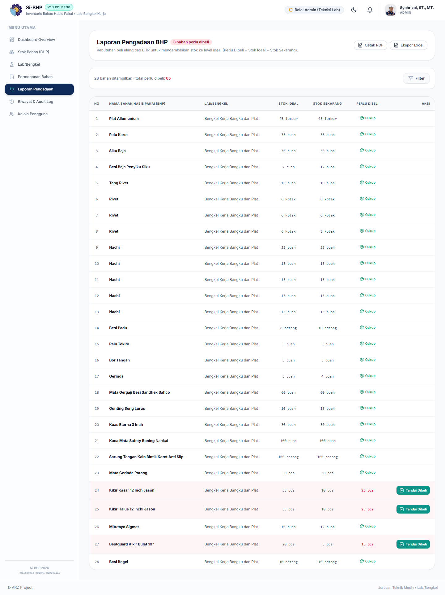
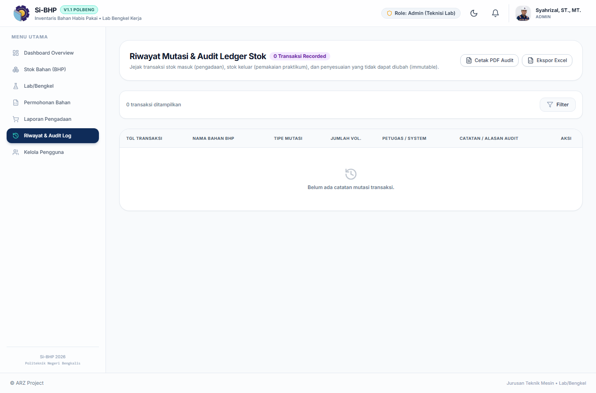
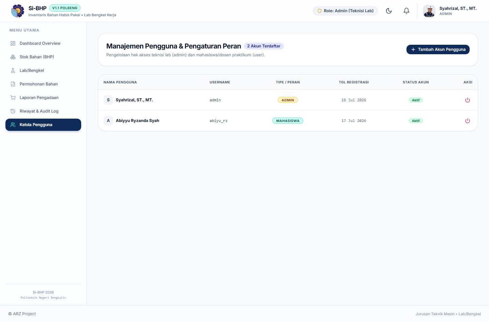

# Panduan Pengguna — Si-BHP

**Sistem Informasi Inventaris Bahan Habis Pakai**
Jurusan Teknik Mesin — Politeknik Negeri Bengkalis

Alamat web: **https://si-bhp.netlify.app**

---

## Daftar Isi

1. [Sekilas Tentang Si-BHP](#1-sekilas-tentang-si-bhp)
2. [Masuk / Login](#2-masuk--login)
3. [Dashboard](#3-dashboard)
4. [Stok Bahan (BHP)](#4-stok-bahan-bhp)
5. [Lab/Bengkel](#5-labbengkel)
6. [Permohonan Bahan & Cetak Surat](#6-permohonan-bahan--cetak-surat)
7. [Laporan Pengadaan](#7-laporan-pengadaan)
8. [Riwayat & Audit Log](#8-riwayat--audit-log)
9. [Kelola Pengguna](#9-kelola-pengguna)
10. [Profil, Mode Gelap & Notifikasi](#10-profil-mode-gelap--notifikasi)
11. [Pertanyaan yang Sering Muncul (FAQ)](#11-pertanyaan-yang-sering-muncul-faq)

---

## 1. Sekilas Tentang Si-BHP

Si-BHP adalah aplikasi web untuk mendata dan mengelola **Bahan Habis Pakai (BHP)** di
laboratorium / bengkel Jurusan Teknik Mesin. Dengan Si-BHP Anda bisa:

- Mendata seluruh bahan beserta stok, spesifikasi, dan batas minimumnya.
- Mengajukan **permohonan pemakaian bahan** dan mencetak **surat permohonan** resmi (berkop Polbeng).
- Melihat bahan mana yang **stoknya kritis** dan perlu dibeli.
- Membuat **Laporan Pengadaan** (daftar belanja) otomatis.
- Menyimpan **jejak audit** setiap perubahan stok yang tidak bisa dihapus.

### Dua jenis peran (role)

| Peran | Siapa | Bisa apa |
|-------|-------|----------|
| **Admin** (Teknisi Lab) | Pengelola lab/bengkel | Semua fitur: tambah/edit/hapus bahan, setujui permohonan, kelola pengguna, laporan pengadaan. |
| **User** (Mahasiswa/Dosen) | Pemohon bahan | Melihat stok, mengajukan permohonan, mencetak surat, melihat riwayat. |

> Panduan ini menampilkan tampilan **Admin** (paling lengkap). Sebagian menu tidak muncul untuk User.

---

## 2. Masuk / Login

Buka **https://si-bhp.netlify.app**, lalu masukkan **username** dan **password**.

- Centang **"Ingat saya"** bila ingin tetap login. Bila tidak dicentang, sesi otomatis
  berakhir jika aplikasi ditinggalkan lebih dari 5 menit.
- Ikon **mata** di kolom password untuk menampilkan/menyembunyikan tulisan password.
- Lupa password? Klik **"Lupa Password"**, cocokkan username + email, lalu buat password baru.
- Belum punya akun? Klik tab **Daftar** untuk registrasi (menunggu diaktifkan admin bila perlu).

> **Penting untuk Admin:** akun bawaan adalah `admin` / `admin123`.
> **Segera ganti password ini** setelah pertama kali masuk (lihat [Profil](#10-profil-mode-gelap--notifikasi)).

---

## 3. Dashboard

Halaman pertama setelah login. Berisi ringkasan cepat: sapaan, jumlah jenis bahan,
permohonan menunggu, dan peringatan stok kritis.

- Kartu-kartu ringkasan bisa **diklik** untuk langsung menuju halaman terkait.
- Bila ada bahan kritis, muncul **kotak peringatan merah** — klik untuk langsung
  membuka daftar bahan yang kritis.

---

## 4. Stok Bahan (BHP)

Inti dari aplikasi: daftar semua bahan beserta stoknya.

### Membaca tabel

- **Sisa Stok**: jumlah stok saat ini. Berubah warna **merah** bila kritis.
- **Threshold Min**: batas minimum. Bila sisa stok ≤ batas ini, status jadi **KRITIS (Reorder)**.
- **Status**: `Aman` (hijau) atau `KRITIS (Reorder)` (merah).
- **Spesifikasi** ditampilkan di bawah nama bahan (mis. `0.8 mm`).

### Bahan dengan banyak spesifikasi (kelompok)

Bahan bernama sama (mis. **Rivet**, **Nachi**) ditampilkan **satu baris** dengan label
`3 spesifikasi` / `5 spesifikasi`. **Klik namanya** untuk membuka daftar tiap spesifikasi,
lengkap dengan stok dan aksinya masing-masing. Klik lagi untuk menutup.

### Mencari & memfilter

- **Kolom pencarian**: ketik nama bahan **atau** spesifikasi.
- **Tombol Filter**: saring berdasarkan Lab/Bengkel, Semester, Kualitas, atau Status Stok.
  Filter yang aktif tampil sebagai **chip** dan bisa dihapus satu per satu.

### Menambah bahan baru *(Admin)*

Klik **"+ Tambah Bahan Baru"**, isi form (nama, spesifikasi, lab, satuan, stok, batas min,
dan **Stok Ideal / Target Penuh**), lalu **Simpan Data**.

- **Tombol "Simpan & Tambah Lagi"**: menyimpan bahan namun **menahan** nama/lab/semester/satuan
  agar Anda tinggal mengganti **spesifikasi + stok** untuk varian berikutnya. Cocok untuk
  memasukkan banyak spesifikasi dari satu nama (mis. Nachi 3mm, 3,5mm, 4mm, ...) tanpa
  mengetik ulang namanya.
- **Stok Ideal (Target Penuh)** dipakai untuk menghitung kebutuhan belanja di Laporan Pengadaan.

### Tombol aksi per baris *(Admin)*

- **⊕ (hijau)** — **Restock**: menambah stok (mis. barang baru datang). Tercatat di audit.
- **✎ (biru)** — **Edit** data bahan.
- **🗑 (merah)** — **Hapus** bahan. *Bahan yang sudah pernah dipakai di permohonan/transaksi
  tidak bisa dihapus* demi menjaga keutuhan jejak audit.

### Ekspor

Tombol **Ekspor PDF** / **Ekspor Excel** untuk mengunduh daftar bahan (mengikuti filter yang aktif).

---

## 5. Lab/Bengkel

Daftar seluruh lab/bengkel beserta **kepala lab** dan **NIP**-nya. Data inilah yang muncul
sebagai penanda tangan pada surat permohonan.

Admin dapat menambah, mengedit, atau menghapus data lab/bengkel.

---

## 6. Permohonan Bahan & Cetak Surat

Tempat mengajukan pemakaian bahan dan mencetak surat resminya.

### Membuat permohonan

Klik tombol tambah permohonan, lalu isi: pemohon, bahan yang diminta, jumlah, mata kuliah
(diketik bebas), semester, jam praktikum, dan tanggal. Simpan.

### Alur persetujuan *(Admin)*

- **Setujui** — stok otomatis berkurang sesuai jumlah, dan tercatat di audit.
- **Tolak** — permohonan ditolak (stok tidak berubah).
- **Batalkan** — untuk permohonan yang **sudah disetujui**; stok **dikembalikan** dan
  tercatat di audit. Wajib mengisi alasan.
- **Hapus** — hanya untuk permohonan berstatus *menunggu* atau *ditolak*. Wajib alasan.

### Mencetak surat

Klik tombol cetak pada sebuah permohonan → muncul **pratinjau surat** berkop Polbeng.
Klik **Cetak** di pojok untuk mencetak atau menyimpan sebagai PDF melalui dialog browser.
Format surat menyesuaikan pemohon (mahasiswa/dosen) dan kepala lab yang dituju.

---

## 7. Laporan Pengadaan

Daftar belanja otomatis: bahan mana yang perlu dibeli agar stok kembali ke level ideal.

- **Perlu Dibeli** = *Stok Ideal − Stok Sekarang*.
- **Terpakai** = total stok yang pernah keluar.
- Filter per **Lab/Bengkel** dan toggle **"hanya yang perlu dibeli"**.
- **Ekspor PDF/Excel** untuk dijadikan dokumen pengajuan.

### Tombol "Tandai Dibeli"

Muncul pada baris yang masih perlu dibeli. Setelah barang benar-benar dibeli, klik tombol ini
→ isi **jumlah yang dibeli** + catatan → **stok bahan otomatis bertambah** dan tercatat di audit.
Kebutuhan belanja pun otomatis mengecil.

---

## 8. Riwayat & Audit Log

Catatan **semua pergerakan stok**: stok masuk (pengadaan), stok keluar (pemakaian), dan
penyesuaian. Ini adalah bukti/jejak yang **tidak dapat diubah (immutable)**.

- Filter berdasarkan tipe: Stok Masuk / Stok Keluar / Penyesuaian.
- **Ekspor PDF/Excel** untuk pelaporan.

### Membatalkan / mengoreksi transaksi *(Admin)*

Salah input (mis. restock coba-coba)? Pada entri **stok masuk/keluar** ada tombol **"Batalkan"**:

- Baris audit asli **tidak dihapus** (jejak tetap jujur).
- **Stok dikembalikan** ke kondisi sebelum transaksi tersebut.
- Pembatalan dicatat sebagai **entri koreksi baru**. Wajib mengisi alasan.

> Prinsipnya: audit tidak pernah benar-benar dihapus — kesalahan diperbaiki lewat koreksi,
> bukan penghapusan. Ini menjaga sistem tetap dapat dipercaya.

---

## 9. Kelola Pengguna

*(Hanya Admin)* Mengatur akun pengguna aplikasi.

- **Tambah pengguna**: nama, username, email, password (min. 8 karakter), dan tipe
  (mahasiswa / dosen-tendik / admin).
- **Aktif/Nonaktif**: menonaktifkan akun tanpa menghapusnya.
- **Hapus permanen**: hanya untuk akun **nonaktif** yang **belum punya** riwayat
  permohonan/transaksi (agar jejak audit tetap utuh).

---

## 10. Profil, Mode Gelap & Notifikasi

Di bagian **kanan atas** aplikasi:

- **Ikon profil** → buka menu **Profil** untuk mengubah nama, foto, dan **password**.
  (Di sinilah admin mengganti password bawaan `admin123`.)
- **Ikon bulan/matahari** → beralih **Mode Terang / Gelap**.
- **Ikon lonceng** → **notifikasi**: menampilkan jumlah bahan kritis dan permohonan
  menunggu. Klik notifikasi kritis untuk langsung membuka **Stok Bahan yang sudah tersaring
  hanya yang kritis**.

Di **layar HP**, menu samping disembunyikan; buka lewat **tombol garis-tiga (hamburger)**
di kiri atas.

---

## 11. Pertanyaan yang Sering Muncul (FAQ)

**Kenapa satu bahan (mis. Nachi) muncul cuma satu baris?**
Karena spesifikasinya banyak, jadi dikelompokkan. Klik namanya untuk melihat semua spesifikasi.

**Kenapa bahan tidak bisa dihapus?**
Bahan yang sudah punya riwayat permohonan/transaksi sengaja dikunci agar jejak audit tetap utuh.
Bila sudah tidak dipakai, kosongkan penggunaannya atau biarkan sebagai arsip.

**Saya salah menambah stok (restock), bagaimana?**
Buka **Riwayat & Audit**, cari entri tersebut, klik **Batalkan**, isi alasan. Stok otomatis
dikembalikan dan koreksi tercatat.

**Setelah barang dibeli, apakah stok nambah otomatis?**
Ya. Gunakan **"Tandai Dibeli"** di Laporan Pengadaan, atau tombol **Restock (⊕)** di Stok Bahan.

**Data hilang saat pindah halaman?**
Tidak. Semua data tersimpan di server (database). Cukup pastikan koneksi internet aktif.

---

*Dokumen ini dibuat untuk membantu pengguna Si-BHP. Untuk perubahan fitur di masa depan,
panduan ini dapat diperbarui kembali.*
